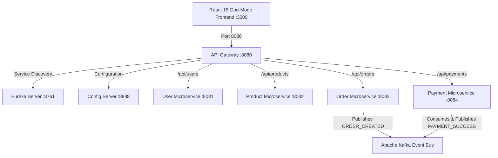

# 📖 FlavorDash — Master Project & Technical Interview Guide (0 to 100)
> **Author**: Created for **Chaithanya**  
> **Project Name**: FlavorDash — Event-Driven Microservices Food Delivery Platform  
> **Target Audience**: Beginners to Advanced Engineers, Technical Interviewers, Project Reviewers  

---

## 📚 MODULE 1: PROJECT OVERVIEW & EXECUTIVE SUMMARY

### 1.1 What is FlavorDash?
**FlavorDash** is a modern, enterprise-grade **Full-Stack Food Delivery Web Application** built using a **Spring Boot 3 Microservices Architecture** on the backend and a **React 18 + Vite** frontend.

It mirrors real-world commercial platforms like **Swiggy**, **Zomato**, and **DoorDash**, but introduces cutting-edge differentiator features like:
- 🛒 **Swiggy/Zomato-Style Floating Cart Strip**: Instant bottom-bar checkout across pages.
- 👥 **Multi-User Group Ordering & Instant UPI Bill Splitting**: Collaborative cart ordering with room codes.
- 🧠 **AI Macro-Nutrient & Dietary Engine**: Instant filtering by High Protein 💪, Keto 🥑, Jain 🌿, and Low Calorie ⚡.
- 👨‍🍳 **Merchant Kitchen Dashboard (`/kitchen`)**: Live order pipeline management for restaurant chefs.
- 🛵 **Rider Telemetry & GPS Tracker (`/driver`)**: Interactive delivery partner dashboard with route simulation.
- ⚙️ **Live Backend Diagnostics Modal**: Real-time health monitoring of all 7 Spring Boot microservices from the navbar.

---

## 🛠️ MODULE 2: PREREQUISITES & FRESH SYSTEM SETUP GUIDE

If you get a brand new computer with nothing installed, here is how you set up FlavorDash from scratch:

### 2.1 Software to Install
1. **Node.js (v18 or v20)**: Downloads the JavaScript runtime for React. Download from [nodejs.org](https://nodejs.org).
2. **Java JDK 17**: Downloads the Java Development Kit required for Spring Boot. Download OpenJDK 17 or Eclipse Temurin 17.
3. **Apache Maven**: Build tool for Java. (Usually bundled with IDEs like IntelliJ or VS Code).
4. **Git**: Version control tool to pull code from GitHub. Download from [git-scm.com](https://git-scm.com).

---

### 2.2 How to Run the Project Locally (2 Simple Commands)

#### Step 1: Open Terminal in Project Root
```bash
cd C:\Users\Student\.gemini\antigravity\scratch\food-delivery-app
```

#### Step 2: Start All 7 Spring Boot Microservices
Run the automated PowerShell script provided in the repository:
```powershell
./run-all.ps1
```
*(This builds and launches Config Server 8888, Eureka Server 8761, User Service 8081, Product Service 8082, Order Service 8083, Payment Service 8084, and API Gateway 8080).*

#### Step 3: Start the React Frontend
Open a second terminal window:
```bash
cd frontend
npm install
npm run dev
```

Open **[http://localhost:3000](http://localhost:3000)** in your browser!

---

## 🧠 MODULE 3: CORE CONCEPTS & TERMINOLOGY FOR BEGINNERS

If an interviewer asks you what these terms mean, here are the exact definitions:

| Term | What It Means (Simple Explanation) | Real-World Analogy |
|---|---|---|
| **Frontend** | The visual user interface (UI) built with HTML, CSS, React that users see and click on. | The dining area & menu card in a restaurant. |
| **Backend** | The hidden server logic that processes data, calculates totals, and communicates with databases. | The kitchen & chefs behind closed doors. |
| **REST API** | A set of rules allowing Frontend and Backend to exchange data formatted as JSON over HTTP requests (GET, POST, PUT, DELETE). | The waiter taking your order to the kitchen. |
| **Monolith** | Putting all app features (users, products, orders, payments) into **one single massive codebase**. | A small bakery where 1 person does everything. If he falls sick, shop closes. |
| **Microservices** | Breaking the app into **independent smaller services** (User Service, Order Service, Payment Service). | A huge hotel with separate bakery, main kitchen, cash counter, and valet service. |
| **Eureka Server** | A central telephone directory where all microservices register their IP addresses & port numbers. | A hotel reception directory. |
| **API Gateway** | The single entry point (door keeper) for all incoming frontend requests that forwards them to the correct microservice. | A security guard at the entrance routing guests. |
| **Config Server** | A centralized server that stores application settings (YAML configs) for all microservices in one place. | The master office notice board. |
| **Apache Kafka** | An event-driven message bus used to broadcast real-time events (e.g. `ORDER_CREATED`, `PAYMENT_COMPLETED`). | A loudspeaker announcement system in a stadium. |

---

## 🏗️ MODULE 4: END-TO-END ARCHITECTURE & FOLDER BREAKDOWN



### 4.1 Microservice Port Breakdown
- **Config Server** (`Port 8888`): Centralized environment configuration.
- **Eureka Server** (`Port 8761`): Service Discovery & Registration.
- **API Gateway** (`Port 8080`): Reactive Gateway routing `/api/*` traffic.
- **User Service** (`Port 8081`): User registration, profile, role-based access (`CUSTOMER`, `HOTEL_MANAGER`, `RIDER`).
- **Product Service** (`Port 8082`): Food catalog management, Indian dish data, pricing.
- **Order Service** (`Port 8083`): Shopping cart checkout, order placement, Feign Client inter-service calls.
- **Payment Service** (`Port 8084`): Payment processing, mock UPI/Credit card transactions.

---

## 🎓 MODULE 5: TOP 25 TECHNICAL INTERVIEW QUESTIONS & ANSWERS

### Q1: "Can you summarize your project in 30 seconds?"
> **Answer**: "FlavorDash is a full-stack food delivery application built using a Spring Boot 3 microservices architecture and a React 18 frontend. It features 7 decoupled microservices including API Gateway, Eureka Discovery, User, Product, Order, and Payment services communicating asynchronously via Apache Kafka. On the frontend, it offers unique features like collaborative group bill splitting, AI nutrient filtering, live order tracking, a merchant kitchen desk, and a rider GPS telemetry portal."

---

### Q2: "Why did you choose Microservices over a Monolith?"
> **Answer**: "In a food delivery system, different modules have different traffic patterns. For instance, Product searches happen millions of times a day, while Payments happen only during checkout. With microservices:
> 1. **Independent Scalability**: We can scale the Product Service independently without duplicating the Payment Service.
> 2. **Fault Isolation**: If the Payment Service experiences a temporary outage, users can still browse food menus.
> 3. **Tech Stack Flexibility**: Teams can develop services independently."

---

### Q3: "How do your Microservices communicate with each other?"
> **Answer**: "We use two modes of communication:
> 1. **Synchronous (REST & OpenFeign)**: For immediate requests like fetching product details or validating a user ID during checkout using Spring Cloud OpenFeign.
> 2. **Asynchronous (Event-Driven via Apache Kafka)**: When an order is placed, `Order Service` publishes an `ORDER_CREATED` event to Kafka. `Payment Service` consumes the event, processes payment, and emits a `PAYMENT_COMPLETED` event without blocking the user."

---

### Q4: "What is the role of API Gateway in your architecture?"
> **Answer**: "The API Gateway acts as the single point of entry for our React frontend on port 8080. It handles:
> - **Routing**: Directing `/api/products` to Product Service and `/api/orders` to Order Service.
> - **Security & Rate Limiting**: Preventing malicious traffic before it reaches internal services.
> - **CORS Handling**: Resolving Cross-Origin Resource Sharing for browser security."

---

### Q5: "How does Eureka Service Discovery work?"
> **Answer**: "When each microservice starts up, it registers its IP address, port number, and health status with Eureka Server on port 8761. When API Gateway needs to route a request, it asks Eureka for the live network address of the target service instead of hardcoding IP addresses."

---

### Q6: "How did you implement Role-Based Access Control (RBAC)?"
> **Answer**: "Each user profile has a `role` field: `CUSTOMER`, `HOTEL_MANAGER`, or `RIDER`. On the frontend, React React-Router uses a `<ProtectedRoute>` component. If a Customer tries to visit `/kitchen` or `/driver`, the route guard blocks access and redirects to Home with an error toast."

---

### Q7: "How does the Group Bill Splitting feature work?"
> **Answer**: "Users can generate a unique room code (e.g. `FLAVOR-4892`). Multiple friends can join the group cart room. The system calculates the item breakdown per person and generates instant individual UPI QR payment requests."

---

### Q8: "How do you handle Database operations?"
> **Answer**: "We use **Spring Data JPA** with an **H2 in-memory database** for local development, which can seamlessly switch to **PostgreSQL** in production by updating `spring.datasource.url` in `application.yml`."

---

## 🎯 MODULE 6: HOW TO PRESENT THIS CONFIDENTLY IN AN INTERVIEW

When presenting this project to an interviewer:
1. **Start with the Business Value**: Mention that you built a complete end-to-end food delivery platform addressing real customer, restaurant, and rider pain points.
2. **Highlight Architecture & Scale**: Emphasize that it's not just a simple CRUD app, but an **enterprise microservices ecosystem** with 7 decoupled services.
3. **Showcase Unique Innovations**: Talk proudly about your **AI Nutrient Filters**, **Group Cart UPI Split**, **Merchant Kitchen Desk**, and **Rider GPS Tracker**.

---

### 💖 Project Built with Passion by **Chaithanya**
