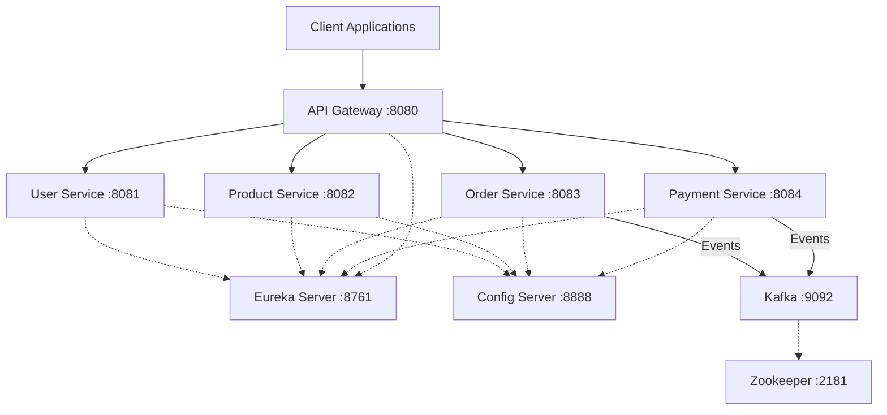

# Food Delivery Microservices App

A robust food delivery application built with Spring Boot microservices, designed for scalability and resilience. The application is containerized using Docker and orchestrated via Kubernetes.

## 🏗️ Architecture



## 🛠️ Tech Stack

| Component | Technology |
|---|---|
| Framework | Spring Boot 3.x |
| Service Discovery | Spring Cloud Eureka |
| Configuration Management | Spring Cloud Config |
| API Gateway | Spring Cloud Gateway |
| Event Streaming | Apache Kafka |
| Containerization | Docker, Docker Compose |
| Orchestration | Kubernetes |

## 📋 Prerequisites

Ensure you have the following installed on your machine:
- Java 17
- Maven 3.8+
- Docker and Docker Compose
- kubectl
- Minikube (for local Kubernetes testing)

## 🚀 How to Run Locally with Docker Compose

1. **Build all microservices**:
   Navigate to the root directory and run:
   ```bash
   mvn clean package -DskipTests
   ```
   *(Note: Ensure you have built the JAR files for all services before starting docker-compose).*

2. **Start the environment**:
   ```bash
   docker-compose up --build
   ```
   This will start all the infrastructure services (Zookeeper, Kafka, Config Server, Eureka) and the microservices.

3. **Verify running services**:
   - Eureka Dashboard: `http://localhost:8761`
   - API Gateway: `http://localhost:8080`

4. **Stop the environment**:
   ```bash
   docker-compose down
   ```

## ☸️ How to Deploy to Kubernetes

1. **Start Minikube**:
   ```bash
   minikube start
   ```

2. **Configure Docker environment to use Minikube's Docker daemon**:
   ```bash
   eval $(minikube docker-env)
   ```

3. **Build Docker images**:
   Build the Docker image for each service (from the respective service directories):
   ```bash
   docker build -t food-delivery/config-server:latest ./config-server
   docker build -t food-delivery/eureka-server:latest ./eureka-server
   docker build -t food-delivery/api-gateway:latest ./api-gateway
   docker build -t food-delivery/user-service:latest ./user-service
   docker build -t food-delivery/product-service:latest ./product-service
   docker build -t food-delivery/order-service:latest ./order-service
   docker build -t food-delivery/payment-service:latest ./payment-service
   ```

4. **Apply Kubernetes Manifests**:
   ```bash
   # Create the namespace first
   kubectl apply -f k8s/namespace.yml
   
   # Deploy infrastructure
   kubectl apply -f k8s/kafka.yml
   kubectl apply -f k8s/config-server.yml
   kubectl apply -f k8s/eureka-server.yml
   
   # Wait for infra to be ready, then deploy services
   kubectl apply -f k8s/user-service.yml
   kubectl apply -f k8s/product-service.yml
   kubectl apply -f k8s/order-service.yml
   kubectl apply -f k8s/payment-service.yml
   
   # Deploy the gateway
   kubectl apply -f k8s/api-gateway.yml
   ```

5. **Access the Application**:
   Since the API Gateway is of type `LoadBalancer`, in Minikube you need to run:
   ```bash
   minikube service api-gateway -n food-delivery
   ```
   This will expose the Gateway URL.

## 🔌 API Endpoints (via API Gateway)

| Service | Endpoint | Example Request |
|---|---|---|
| User Service | `/api/users/**` | `curl -X GET http://localhost:8080/api/users/1` |
| Product Service | `/api/products/**` | `curl -X GET http://localhost:8080/api/products` |
| Order Service | `/api/orders/**` | `curl -X POST http://localhost:8080/api/orders -H "Content-Type: application/json" -d '{"userId": 1, "productId": 2}'` |
| Payment Service | `/api/payments/**` | `curl -X GET http://localhost:8080/api/payments/1` |

## 📁 Project Structure

```text
food-delivery-app/
├── api-gateway/            # API Gateway service
├── config-repo/            # Git repository for Config Server
├── config-server/          # Spring Cloud Config Server
├── eureka-server/          # Service Registry
├── user-service/           # User microservice
├── product-service/        # Product microservice
├── order-service/          # Order microservice
├── payment-service/        # Payment microservice
├── docker-compose.yml      # Docker compose configuration
├── k8s/                    # Kubernetes manifests
│   ├── namespace.yml
│   ├── kafka.yml
│   ├── config-server.yml
│   ├── eureka-server.yml
│   ├── api-gateway.yml
│   ├── user-service.yml
│   ├── product-service.yml
│   ├── order-service.yml
│   └── payment-service.yml
└── README.md
```
