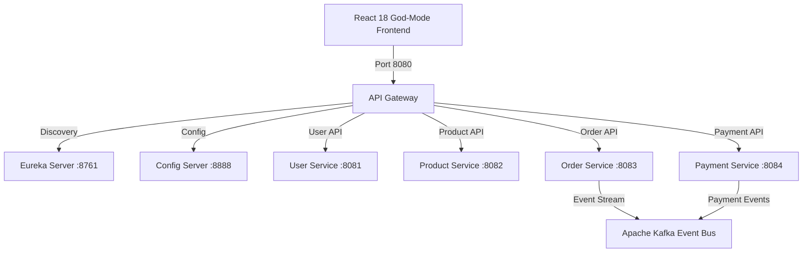

# 🍔 FlavorDash — Next-Gen Microservices Food Delivery Platform

### 💖 Made with ❤️ by **Chaithanya**

[](https://reactjs.org/)
[](https://spring.io/projects/spring-boot)
[](https://spring.io/projects/spring-cloud)
[](https://vitejs.dev/)
[](#)

**FlavorDash** is an enterprise-grade, event-driven food delivery web application built using **Spring Boot 3 microservices** and a **React 18 + Vite** frontend.

---

## 🏗️ Architecture Overview



---

## ⚡ Key Differentiators & Features

1. **🛒 Swiggy/Zomato-Style Floating Cart Bar**: Real-time bottom bar with 1-tap checkout access.
2. **👥 Collaborative Group Order & Instant Bill Split**: Share room code (`FLAVOR-4892`) and split UPI bills dynamically.
3. **🧠 AI Macro-Nutrient & Diet Engine**: Filter by **High Protein 💪**, **Keto 🥑**, **Jain 🌿**, or **Low Calorie ⚡**.
4. **👨‍🍳 Live Kitchen Merchant Portal (`/kitchen`)**: Manage incoming orders & menu stock status in real-time.
5. **🛵 Rider App & GPS Tracker (`/driver`)**: Interactive delivery partner dashboard with route simulation.
6. **⚙️ Live Backend Diagnostics Modal**: Real-time health monitoring of all 7 Spring Boot microservices directly from the navbar.

---

## 🔌 Microservices & API Registry

| Service Name | Port | Base Path | Database |
|---|---|---|---|
| **API Gateway** | `8080` | `/api/*` | Netty / Reactive Proxy |
| **User Service** | `8081` | `/api/users` | H2 / PostgreSQL |
| **Product Service** | `8082` | `/api/products` | H2 / PostgreSQL |
| **Order Service** | `8083` | `/api/orders` | H2 / PostgreSQL |
| **Payment Service** | `8084` | `/api/payments` | H2 / PostgreSQL |
| **Eureka Server** | `8761` | `/` | In-Memory Registry |
| **Config Server** | `8888` | `/` | Native YAML Store |

---

## 🚀 How to Run Locally

### 1. Run Microservices (Spring Boot)
```bash
./run-all.ps1
```

### 2. Run Frontend (React + Vite)
```bash
cd frontend
npm install
npm run dev
```

Open **[http://localhost:3000](http://localhost:3000)** in your browser!

---

### ✨ Crafted with passion & ❤️ by **Chaithanya** (`@chaithanya762`)
