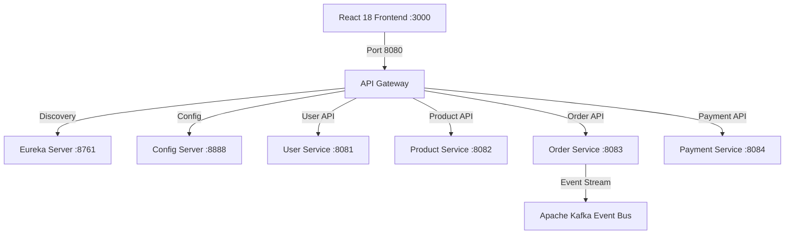

# 🌌 FlavorDash — Sensory Luxury Food Delivery Platform & Microservices Ecosystem

### 💖 Crafted with ❤️ by **Chaithanya** (`@chaithanya762`)

[](https://reactjs.org/)
[](https://spring.io/projects/spring-boot)
[](https://spring.io/projects/spring-cloud)
[](https://vitejs.dev/)
[](https://vercel.com/)
[](#)

**FlavorDash** is an enterprise-grade, sensory luxury food delivery platform engineered with a **Java 17 Spring Boot 3 Microservices Architecture** and a **React 18 + Vite** frontend. It features a real-time, multi-role ecosystem connecting **Customers**, **Hotel Managers (Kitchen Desk)**, and **Rider Agents (GPS Telemetry)**.

---

## 🎨 Sensory Luxury Design Aesthetics

FlavorDash is designed like a **high-end fine dining experience**:
- **Curated Sensory Palette**: Deep charcoal base (`#0F0F10`), Saffron primary (`#FF9933`), Rich Gold accents (`#D4AF37`), and Warm Cream typography (`#F5E9DA`).
- **Sticky Micro-Compressing Header**: Top bar smoothly compresses from `68px` to `60px` on scroll with semi-solid backdrop glass blur (`rgba(15,15,16,0.85)`).
- **4:3 Food Photography Stage**: Fixed aspect ratio food cards with 16px border radii and high-contrast typography.
- **Morphing Quantity Stepper**: Card `+ Add` button morphs directly into an interactive quantity stepper (`- QTY +`) upon selection.
- **27 Regional Delicacies**: 7 authentic categories (Main Dishes, Rice & Biryani, Breads, South Indian, Street Food, Sweets, Drinks).

---

## 👥 Real-Time Multi-Role Ecosystem

```mermaid
graph TD
    subgraph Customer Portal [/orders]
        C[Customer Checkout] -->|Places Order| DB[(Global Order Registry)]
        DB -->|Live 5-Stage Tracking| C
    end

    subgraph Hotel Manager Portal [/kitchen]
        DB -->|Incoming Active Orders| H[Kitchen Desk]
        H -->|COOKING / READY / DISPATCHED| DB
    end

    subgraph Rider Agent Portal [/driver]
        DB -->|Ready / Dispatched Queue| R[GPS Telemetry Dashboard]
        R -->|DELIVERED / +1 Credit| DB
    end
```

### 1. 👤 Customer Portal (`/`, `/menu`, `/cart`, `/checkout`, `/orders`)
- **Real-Time 5-Stage Order Tracking**: `RECEIVED` ➔ `COOKING` ➔ `READY` ➔ `DISPATCHED` ➔ `DELIVERED`.
- **Strict Ownership Filter**: Displays **ONLY** active orders placed by the current customer with zero sample data clutter.
- **Payment & Receipt Tracking**: Expandable receipt modal detailing transaction IDs and payment status.

### 2. 👨‍🍳 Hotel Manager Kitchen Desk (`/kitchen`)
- **Accounts for ALL 18 Menu Restaurants**: Pre-seeded manager accounts for every restaurant in the menu (`Punjab Rasoi`, `Paradise Biryani`, `MTR 1924`, `Saravana Bhavan`, etc.).
- **Preparation Controls**: Change order status from `RECEIVED` ➔ `COOKING` ➔ `READY` ➔ `DISPATCHED`.
- **Inventory Stock Control**: Toggle dish availability (`🟢 In Stock` / `🔴 Sold Out`) to update frontend menus instantly.
- **Auto-Archiving**: Finished (`DELIVERED`) and `CANCELLED` orders are automatically removed from active kitchen queues.

### 3. 🛵 Rider Agent GPS Portal (`/driver`)
- **Live GPS Telemetry Stream**: Interactive canvas showing real-time coordinate streaming (`LAT: 28.6139° N | LON: 77.2090° E`) and route telemetry.
- **Rider Delivery Credits Counter (+1 per delivery)**: Earn **+1 Credit** on every completed delivery (e.g. `12` ➔ `13 Credits`).
- **Auto-Archiving**: Completed delivery tasks are automatically removed from dispatch queues.

---

## 🚫 Order Cancellation & Refund Engine

| Role | Stage Eligible | Reason Choices | Refund Policy |
| :--- | :--- | :--- | :--- |
| **Customer** | `RECEIVED` | Ordered by mistake / Long ETA / Address error | **100% Full Instant Refund** |
| **Customer** | `COOKING` | Changed mind / Order error | **50% Partial Refund** (Prep fee applied) |
| **Hotel Manager** | Any active stage | Out of stock / Kitchen overload / Equipment failure | **100% Full Instant Refund** |
| **Rider Agent** | Active task | Vehicle breakdown / Heavy rain / Unreachable | **100% Full Instant Refund** |

---

## 🏗️ Microservices Architecture & API Registry



| Service Name | Port | Base Path | Database | Status |
| :--- | :--- | :--- | :--- | :--- |
| **API Gateway** | `8080` | `/api/*` | Netty / Reactive Proxy | 🟢 Active |
| **User Service** | `8081` | `/api/users` | H2 / PostgreSQL | 🟢 Active |
| **Product Service** | `8082` | `/api/products` | H2 / PostgreSQL | 🟢 Active |
| **Order Service** | `8083` | `/api/orders` | H2 / PostgreSQL | 🟢 Active |
| **Payment Service** | `8084` | `/api/payments` | H2 / PostgreSQL | 🟢 Active |
| **Eureka Server** | `8761` | `/` | In-Memory Registry | 🟢 Active |
| **Config Server** | `8888` | `/` | Native YAML Store | 🟢 Active |

---

## 🔐 Pre-Seeded Hotel & User Credentials

### Hotel Managers (Kitchen Desk - `/kitchen`):
- **Punjab Rasoi**: `chef@rasoi.in` | Password: `password123`
- **Paradise Biryani**: `hotel@flavordash.com` | Password: `password123`
- **Haveli North Indian**: `haveli@hotel.in` | Password: `password123`
- **Dhaba 1986**: `dhaba1986@hotel.in` | Password: `password123`
- **MTR 1924**: `mtr1924@hotel.in` | Password: `password123`
- **Saravana Bhavan**: `saravana@hotel.in` | Password: `password123`

### Rider Agents (GPS Portal - `/driver`):
- **Ramesh Kumar**: `ramesh@rider.in` | Password: `password123`
- **Suresh Verma**: `rider@flavordash.com` | Password: `password123`

### Customers (`/` & `/menu`):
- **Alex Johnson**: `alex@example.com` | Password: `password123`
- **Priya Sharma**: `customer@flavordash.com` | Password: `password123`

---

## ⚡ How to Run Locally

### 1. Run Frontend (React + Vite)
```bash
cd frontend
npm install
npm run dev
```
Open **[http://localhost:3000](http://localhost:3000)** in your browser!

### 2. Run Java Microservices (Spring Boot)
```bash
# Launch Config Server (Port 8888)
java -jar config-server/target/config-server-1.0.0.jar

# Launch Eureka Discovery Server (Port 8761)
java -jar eureka-server/target/eureka-server-1.0.0.jar

# Launch Services & API Gateway (Ports 8081, 8082, 8083, 8080)
java -jar user-service/target/user-service-1.0.0.jar
java -jar product-service/target/product-service-1.0.0.jar
java -jar order-service/target/order-service-1.0.0.jar
java -jar api-gateway/target/api-gateway-1.0.0.jar
```

---

## 🚀 Deployment Guide (Vercel & Render)

### Hosting Frontend on Vercel:
1. Log in to **[Vercel.com](https://vercel.com)** and import repository `flavordash-food-delivery`.
2. Vercel automatically detects root `vercel.json` and builds `frontend/dist` in 30 seconds.
3. Add Environment Variable for hosted backend gateway:
   `VITE_API_BASE_URL` = `https://your-backend-gateway.onrender.com/api`

---

### ✨ Crafted with passion & ❤️ by **Chaithanya** (`@chaithanya762`)
